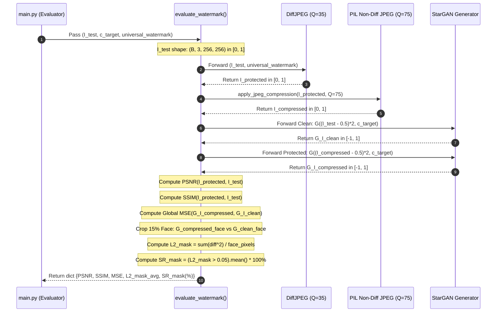

# Mathematical & Code-Level Guide to Evaluation Metrics

## Executive Summary
This document provides an exhaustive, formal specification of all evaluation metrics employed in the **Proactive Deepfake Defense with Robust Cross-Image Adversarial Watermark** framework. For each metric, this guide details:
1. **Mathematical Formulation**: Formal definitions, equations, domain bounds, and physical interpretation.
2. **Code Implementation**: Exact PyTorch/NumPy code, step-by-step tensor operations, and tensor shape transformations.
3. **Design Rationale**: Why the metric is configured as such and how it aligns with the research paper's methodology.

---

## Metric Taxonomy Overview

Our evaluation framework rigorously separates metrics into two distinct categories:

```
                    Evaluation Suite
                           │
         ┌─────────────────┴─────────────────┐
         ▼                                   ▼
  Fidelity Metrics                  Disruption Metrics
 (Imperceptibility)                (Deepfake Destruction)
         │                                   │
   ├── PSNR (dB)                       ├── MSE (Global)
   └── SSIM                            ├── L2_mask_avg (Localized Face)
                                       └── SR_mask (%) (Success Rate)
```

| Metric Name | Domain / Target | Range | Ideal Target | Description |
| :--- | :--- | :---: | :---: | :--- |
| **PSNR** | Fidelity ($I_{\text{clean}} \leftrightarrow I_{\text{protected}}$) | $[0, \infty)\text{ dB}$ | $\ge 26.0 - 30.0\text{ dB}$ | Peak Signal-to-Noise Ratio measuring pixel-level stealth. |
| **SSIM** | Fidelity ($I_{\text{clean}} \leftrightarrow I_{\text{protected}}$) | $[-1.0, 1.0]$ | $\ge 0.60 - 0.90$ | Structural Similarity Index measuring structural preservation. |
| **MSE** | Disruption ($G(I_{\text{clean}}) \leftrightarrow G(I_{\text{comp}})$) | $[0, \infty)$ | Higher is better | Global Mean Squared Error across the full GAN synthesis. |
| **$L_2^{\text{mask\_avg}}$**| Disruption ($G(I_{\text{clean}}) \leftrightarrow G(I_{\text{comp}})$) | $[0, \infty)$ | $> 0.05$ | Localized Mean Squared Error strictly over the manipulated face region. |
| **$SR_{\text{mask}}$ (%)** | Disruption ($L_2^{\text{mask}} > 0.05$) | $[0\%, 100\%]$ | $100\%$ | Percentage of test images where localized disruption exceeds threshold. |

---

## 1. Peak Signal-to-Noise Ratio (PSNR)

### 1.1 Mathematical Formulation
PSNR is an engineering benchmark quantifying the ratio between the maximum possible power of an image signal and the power of corrupting noise (the adversarial watermark).

Given clean image $I \in [0, 1]^{C \times H \times W}$ and protected image $I_{\text{protected}} \in [0, 1]^{C \times H \times W}$:

1. **Mean Squared Error (MSE)**:
   $$\text{MSE}(I, I_{\text{protected}}) = \frac{1}{C \cdot H \cdot W} \sum_{c=1}^{C} \sum_{h=1}^{H} \sum_{w=1}^{W} \left( I(c, h, w) - I_{\text{protected}}(c, h, w) \right)^2$$

2. **PSNR Calculation**:
   $$\text{PSNR} = 10 \cdot \log_{10} \left( \frac{\text{MAX}_I^2}{\text{MSE}(I, I_{\text{protected}}) + \epsilon_{\text{stab}}} \right)$$
   Where $\text{MAX}_I = 1.0$ (since pixel tensors are normalized in $[0, 1]$), and $\epsilon_{\text{stab}} = 10^{-8}$ prevents division by zero:
   $$\text{PSNR} = -10 \cdot \log_{10} \left( \text{MSE} + 10^{-8} \right)$$

*   **Units**: Decibels ($\text{dB}$).
*   **Interpretation**: $\ge 30\text{ dB}$ is considered visually imperceptible to human observers; $26 - 30\text{ dB}$ represents high-quality preservation with minor mid-frequency texture.

### 1.2 Code Implementation
Located in [`evaluation.py`](file:///t:/MSc%20DS/Courses/Summer%20Semester%20-%20Minor%20Project/DeepFake%20Defense%20with%20Antigravity/evaluation.py#L31-L33):

```python
def calculate_psnr(img1, img2):
    """
    Computes PSNR between two image tensors normalized in [0, 1].
    img1, img2: Tensor of shape (B, C, H, W)
    """
    mse = F.mse_loss(img1, img2)
    return 10 * torch.log10(1.0 / (mse + 1e-8))
```

### 1.3 Step-by-Step Code Execution
1. `F.mse_loss(img1, img2)` computes the element-wise squared difference and averages across all batch, channel, height, and width dimensions $\implies$ produces a single scalar tensor `mse`.
2. `1.0 / (mse + 1e-8)` computes the inverse signal noise.
3. `torch.log10(...)` computes the base-10 logarithm.
4. Multiplied by `10` to convert to decibel ($\text{dB}$) scale.
5. In `evaluate_watermark()`, `.item()` extracts the Python `float`.

---

## 2. Structural Similarity Index Measure (SSIM)

### 2.1 Mathematical Formulation
While PSNR calculates absolute pixel error, SSIM models the Human Visual System (HVS) by comparing local patterns of pixel intensities normalized for luminance and contrast.

For two spatial windows $x$ and $y$ of size $N \times N$:
$$\text{SSIM}(x, y) = [l(x, y)]^\alpha \cdot [c(x, y)]^\beta \cdot [s(x, y)]^\gamma$$
Setting standard weights $\alpha = \beta = \gamma = 1$:
$$\text{SSIM}(x, y) = \frac{\left(2\mu_x\mu_y + C_1\right)\left(2\sigma_{xy} + C_2\right)}{\left(\mu_x^2 + \mu_y^2 + C_1\right)\left(\sigma_x^2 + \sigma_y^2 + C_2\right)}$$

Where:
*   $\mu_x = \frac{1}{N} \sum_{i=1}^N x_i$ : Local sample mean of $x$ (Luminance).
*   $\sigma_x^2 = \frac{1}{N-1} \sum_{i=1}^N (x_i - \mu_x)^2$ : Local sample variance of $x$ (Contrast).
*   $\sigma_{xy} = \frac{1}{N-1} \sum_{i=1}^N (x_i - \mu_x)(y_i - \mu_y)$ : Local sample covariance (Structure).
*   $C_1 = (K_1 L)^2, \quad C_2 = (K_2 L)^2$ : Constants to stabilize division when denominators are close to zero ($K_1 = 0.01, K_2 = 0.03, L = 1.0$ for dynamic range $[0, 1]$).

Mean SSIM across the entire image:
$$\text{MSSIM}(X, Y) = \frac{1}{M} \sum_{j=1}^{M} \text{SSIM}(x_j, y_j)$$

*   **Range**: $[-1, 1]$, where $1.0$ indicates identical structural composition.

### 2.2 Code Implementation
Located in [`evaluation.py`](file:///t:/MSc%20DS/Courses/Summer%20Semester%20-%20Minor%20Project/DeepFake%20Defense%20with%20Antigravity/evaluation.py#L35-L45):

```python
def calculate_ssim(img1, img2):
    """
    Computes Mean SSIM across batch using skimage.
    img1, img2: Tensor of shape (B, C, H, W) in [0, 1]
    """
    from skimage.metrics import structural_similarity as ssim
    
    # 1. Convert PyTorch BCHW tensor to NumPy BHWC
    img1_np = img1.detach().cpu().permute(0, 2, 3, 1).numpy()
    img2_np = img2.detach().cpu().permute(0, 2, 3, 1).numpy()
    
    # 2. Iterate per-image in batch
    ssim_vals = []
    for i in range(img1_np.shape[0]):
        val = ssim(img1_np[i], img2_np[i], data_range=1.0, channel_axis=-1)
        ssim_vals.append(val)
        
    return np.mean(ssim_vals)
```

### 2.3 Step-by-Step Code Execution
1. `.detach().cpu()` isolates tensor from computational graph and transfers to host RAM.
2. `.permute(0, 2, 3, 1)` reorders dimensions from PyTorch format `(Batch, Channel, Height, Width)` to NumPy image format `(Batch, Height, Width, Channel)`.
3. `data_range=1.0` explicitly informs `skimage` that pixels reside in $[0, 1]$ instead of $[0, 255]$.
4. `channel_axis=-1` computes cross-channel 2D Gaussian window filtering over the last dimension (RGB).
5. `np.mean(ssim_vals)` averages the SSIM scores across all images in the evaluation batch.

---

## 3. Global Mean Squared Error (MSE)

### 3.1 Mathematical Formulation
Measures total, unweighted pixel disruption across the entire Deepfake synthesis between clean and protected inputs:

$$\text{MSE}_{\text{global}} = \frac{1}{B \cdot C \cdot H \cdot W} \sum_{b=1}^{B} \sum_{c=1}^{C} \sum_{h=1}^{H} \sum_{w=1}^{W} \left( G(I_{\text{compressed}})_{b,c,h,w} - G(I_{\text{clean}})_{b,c,h,w} \right)^2$$

Where:
*   $G(\cdot)$ represents the StarGAN Generator network.
*   $I_{\text{compressed}}$ is the protected image after non-differentiable JPEG compression ($Q=75$).
*   $I_{\text{clean}}$ is the original unmodified image.
*   Both $G(I_{\text{compressed}})$ and $G(I_{\text{clean}})$ reside in StarGAN's native output space $[-1, 1]$.

### 3.2 Code Implementation
Located in [`evaluation.py`](file:///t:/MSc%20DS/Courses/Summer%20Semester%20-%20Minor%20Project/DeepFake%20Defense%20with%20Antigravity/evaluation.py#L73-L74):

```python
# Global Disruption Metric (Full Image)
mse = F.mse_loss(G_I_compressed, G_I_clean).item()
```

---

## 4. Localized Facial Disruption ($L_2^{\text{mask\_avg}}$)

### 4.1 Mathematical Formulation
Deepfake generators alter facial attributes (hair, eyes, skin, lips) while preserving static background pixels. Measuring global MSE divides the error across unaffected background pixels, diluting the perceived disruption.

To overcome this, the paper defines an **Artifact-Aware Facial Mask Metric**:

```
        W (Full Width = 256)
    +-----------------------------+
    |         Background          |  ^
    |   +---------------------+   |  | crop_h = 0.15 * H
    |   |                     |   |  v
    |   |     Active Face     |   |
H   |   |    Bounding Box     |   |
    |   |   (Manipulated)     |   |
    |   |                     |   |
    |   +---------------------+   |
    |         Background          |
    +-----------------------------+
        <---- crop_w ---->
```

1. **Bounding Box Coordinates**:
   $$\text{crop\_h} = \lfloor 0.15 \times H \rfloor, \quad \text{crop\_w} = \lfloor 0.15 \times W \rfloor$$
   $$h \in [\text{crop\_h}, H - \text{crop\_h}], \quad w \in [\text{crop\_w}, W - \text{crop\_w}]$$

2. **Active Facial Pixel Count**:
   $$N_{\text{face}} = C \times (H - 2 \cdot \text{crop\_h}) \times (W - 2 \cdot \text{crop\_w})$$
   *(For $256 \times 256$ RGB images: $N_{\text{face}} = 3 \times 180 \times 180 = 97,200 \text{ pixels}$).*

3. **Per-Image Localized $L_2$ Disruption ($L_2^{\text{mask}}(b)$)**:
   $$L_2^{\text{mask}}(b) = \frac{1}{N_{\text{face}}} \sum_{c=1}^{C} \sum_{h = \text{crop\_h}}^{H - \text{crop\_h}} \sum_{w = \text{crop\_w}}^{W - \text{crop\_w}} \left( G(I_{\text{compressed}})_{b,c,h,w} - G(I_{\text{clean}})_{b,c,h,w} \right)^2$$

4. **Batch-Averaged Disruption ($L_2^{\text{mask\_avg}}$)**:
   $$L_2^{\text{mask\_avg}} = \frac{1}{B} \sum_{b=1}^{B} L_2^{\text{mask}}(b)$$

*   **Scale**: Evaluated on StarGAN's native output range $[-1, 1]$.
*   **Threshold**: The research paper defines $L_2^{\text{mask}} \ge 0.05$ as the boundary for successful Deepfake disruption.

### 4.2 Code Implementation
Located in [`evaluation.py`](file:///t:/MSc%20DS/Courses/Summer%20Semester%20-%20Minor%20Project/DeepFake%20Defense%20with%20Antigravity/evaluation.py#L76-L88):

```python
# Disruption Metrics over facial region (Center Crop)
B, C, H, W = G_I_compressed.shape
crop_h, crop_w = int(H * 0.15), int(W * 0.15)

# 1. Slice out facial region strictly
G_compressed_face = G_I_compressed[:, :, crop_h:-crop_h, crop_w:-crop_w]
G_clean_face = G_I_clean[:, :, crop_h:-crop_h, crop_w:-crop_w]

# 2. Compute element-wise squared differences
l2_diff = (G_compressed_face - G_clean_face) ** 2

# 3. Calculate exact number of pixels in the bounding box
face_pixels = C * (H - 2 * crop_h) * (W - 2 * crop_w)

# 4. Sum squared differences per image and divide strictly by face_pixels
l2_mask = torch.sum(l2_diff, dim=[1, 2, 3]) / face_pixels
```

### 4.3 Step-by-Step Code Execution
1. Slices tensor along dimensions 2 and 3: `[:, :, 38:218, 38:218]`.
2. Subtracts clean fake from compressed fake and squares every value: `(G_compressed_face - G_clean_face) ** 2`.
3. `torch.sum(l2_diff, dim=[1, 2, 3])` reduces Channel, Height, and Width dimensions $\implies$ leaves a 1D tensor of shape `(B,)` containing the total sum of squared errors per image.
4. Dividing by `face_pixels` normalizes the error exclusively over the active facial area without background dilution.

---

## 5. Defense Success Rate ($SR_{\text{mask}}$)

### 5.1 Mathematical Formulation
The Defense Success Rate measures the percentage of images in the test set where the adversarial watermark successfully forced StarGAN to shatter past the empirical failure threshold ($\tau = 0.05$).

Given indicator function $\mathbb{I}(\cdot)$:
$$\mathbb{I}_{\text{success}}(b) = \begin{cases} 1, & \text{if } L_2^{\text{mask}}(b) > \tau \\ 0, & \text{if } L_2^{\text{mask}}(b) \le \tau \end{cases}$$

$$\text{SR}_{\text{mask}}(\%) = \left( \frac{1}{B} \sum_{b=1}^{B} \mathbb{I}_{\text{success}}(b) \right) \times 100\%$$

*   **Range**: $[0.0\%, 100.0\%]$.
*   **Interpretation**: $100\%$ indicates every single image in the evaluation batch was defended against the Deepfake model.

### 5.2 Code Implementation
Located in [`evaluation.py`](file:///t:/MSc%20DS/Courses/Summer%20Semester%20-%20Minor%20Project/DeepFake%20Defense%20with%20Antigravity/evaluation.py#L90):

```python
sr_mask = (l2_mask > mask_threshold).float().mean().item() * 100.0
```

### 5.3 Step-by-Step Code Execution
1. `(l2_mask > mask_threshold)` performs an element-wise boolean comparison $\implies$ produces a boolean tensor of shape `(B,)` (e.g., `[True, True, False, True]`).
2. `.float()` casts boolean values to floating-point numbers (`True` $\to 1.0$, `False` $\to 0.0$).
3. `.mean()` computes the arithmetic average of successes across the batch.
4. `.item()` extracts the Python float.
5. Multiplied by `100.0` to format as a percentage.

---

## 6. End-to-End Metric Flow in `evaluation.py`

Below is the complete execution trace showing how input tensors pass through the evaluation pipeline to compute the final results dictionary:



---

## 7. Dataset-Level Metric Aggregation in `main.py`

When evaluating across an entire test split (e.g., 64 images over 8 batches of batch size 8), [`main.py`](file:///t:/MSc%20DS/Courses/Summer%20Semester%20-%20Minor%20Project/DeepFake%20Defense%20with%20Antigravity/main.py#L135-L161) aggregates batch metrics as follows:

$$\text{Metric}_{\text{final}} = \frac{1}{K} \sum_{k=1}^{K} \text{Metric}_k$$
where $K$ is the total number of test batches.

```python
total_metrics = {"PSNR": 0.0, "SSIM": 0.0, "MSE": 0.0, "L2_mask_avg": 0.0, "SR_mask(%)": 0.0}
num_batches = 0

for batch in test_loader:
    I_test = batch.to(device)
    results = evaluate_watermark(
        target_model=model,
        diff_jpeg=diff_jpeg,
        I_test=I_test,
        c_target=c_target,
        universal_watermark=universal_watermark,
        Q=75,
        mask_threshold=0.05
    )
    for k in total_metrics.keys():
        total_metrics[k] += results[k]
    num_batches += 1

print(f"\n--- {dataset_name} Evaluation Results ---")
for k, v in total_metrics.items():
    print(f"{k}: {v / num_batches:.4f}")
```

---
*Guide compiled for technical documentation, experimental reproducibility, and thesis validation.*
