# Proactive Deepfake Defense: Research Pipeline & Technical Implementation Report

## Executive Summary
This document provides a comprehensive technical breakdown of the **Robust Cross-Image Adversarial Watermark** framework for proactive Deepfake defense. It covers the end-to-end theoretical pipeline proposed in the foundational research paper, details how our modular codebase realizes this architecture, explains the mathematical mechanisms of frequency-domain watermarking and differentiable compression, and highlights the critical engineering considerations implemented to ensure numerical stability, imperceptibility, and cross-dataset robustness.

---

## Table of Contents
1. [Research Paper Pipeline & Architectural Mapping](#1-research-paper-pipeline--architectural-mapping)
2. [Frequency-Domain Watermark Embedding](#2-frequency-domain-watermark-embedding)
3. [Differentiable Encoder and Decoder (DiffJPEG)](#3-differentiable-encoder-and-decoder-diffjpeg)
4. [Critical Implementation Nuances & Engineering Considerations](#4-critical-implementation-nuances--engineering-considerations)
5. [Summary of Mathematical Formulations & Hyperparameters](#5-summary-of-mathematical-formulations--hyperparameters)

---

## 1. Research Paper Pipeline & Architectural Mapping

### 1.1 The Theoretical Pipeline
The research paper establishes a **proactive defense paradigm**. Rather than attempting to detect Deepfakes after generation (passive detection), the defense injects an imperceptible, adversarial watermark into genuine facial images before they are uploaded to public platforms or social media. When a malicious entity feeds the protected image into a Deepfake generator (such as StarGAN), the embedded watermark triggers severe artifacts, rendering the generated output unusable.

```mermaid
flowchart TD
    subgraph Proactive Defense Optimization Loop (Training)
        A["Clean Facial Image I"] --> B["Color Transform: RGB to YCbCr"]
        B --> C["2D Block-DCT (8x8)"]
        C --> D["Inject Universal Watermark (w) into Y-Channel"]
        D --> E["Differentiable JPEG Quantization (STE, Q=35)"]
        E --> F["Inverse 2D-DCT & YCbCr to RGB"]
        F --> G["Protected Compressed Image I_inv"]
        G --> H["Target Deepfake Model (StarGAN Generator G)"]
        H --> I["Adversarial Loss Computation: Maximize Disruption, Minimize Distortion"]
        I --> J["Backpropagation via Autograd through G and DiffJPEG to w"]
        J --> K["Intra-Batch Gradient Sign Averaging"]
        K --> L["Inter-Batch Exponential Moving Average (EMA) Fusion"]
    end
    
    subgraph Real-World Testing & Evaluation
        M["Unseen Test Image I_test (CelebA / LFW)"] --> N["Apply Universal Watermark w_universal"]
        N --> O["Standard Non-Differentiable JPEG (Q=75)"]
        O --> P["StarGAN Synthesis G(I_compressed, c_target)"]
        P --> Q["Metric Evaluation: PSNR, SSIM, MSE, L2_mask, SR_mask"]
    end
```

### 1.2 Modular Codebase Mapping
Our implementation translates the paper's theoretical framework into a clean, decoupled, four-tier architecture:

| Codebase Module | Research Paper Component | Exact Role & Responsibilities |
| :--- | :--- | :--- |
| **`jpeg_utils.py`** | Differentiable JPEG Pipeline ($E_n, D_e$) | Implements $RGB \leftrightarrow YCbCr$ transformations, $8 \times 8$ 2D Discrete Cosine Transform (DCT), differentiable quantization using Straight-Through Estimation (STE), and the inverse transform ($IDCT \to RGB$). Also contains standard PIL-based non-differentiable JPEG for real-world validation. |
| **`watermark.py`** | Adversarial Optimizer ($\text{PGD} + \text{Intra-Batch}$) | Constructs the binary mid-frequency mask ($2 \le u+v \le 6$), defines the composite multi-objective adversarial loss function ($L_{\text{disrupt}} - \lambda L_{\text{distortion}}$), and executes the Projected Gradient Descent (PGD) optimization loop with intra-batch gradient sign averaging. |
| **`main.py`** | Central Pipeline & Inter-Batch Fusion ($W_{m+1}$) | Orchestrates model initialization, loads CelebA and LFW datasets, drives the multi-batch training loop, applies Inter-Batch Exponential Moving Average (EMA) fusion ($\beta = 0.50$), extracts diagnostic statistics, executes evaluation, and invokes visualization. |
| **`evaluation.py`** | Benchmark & Metric Evaluation Suite | Quantifies imperceptibility ($\text{PSNR}$, $\text{SSIM}$) and disruption ($\text{MSE}$, $L_2^{\text{mask\_avg}}$, $SR_{\text{mask}}$) on unseen test sets in the native $[-1, 1]$ StarGAN output space over localized facial bounding boxes. |
| **`visualize.py`** | Qualitative Verification | Renders side-by-side 4-panel comparison grids (Clean Original, Protected Image, Clean Fake, Disrupted Fake) and visualizes the normalized spatial adversarial noise pattern. |

---

## 2. Frequency-Domain Watermark Embedding

### 2.1 Why Frequency Domain Instead of Spatial Domain?
Conventional adversarial perturbations applied directly to spatial pixels ($x' = x + \delta$) suffer from a fatal weakness: **JPEG compression susceptibility**. JPEG encoding acts as a lossy low-pass filter, treating spatial high-frequency noise as imperceptible entropy and ruthlessly discarding it during quantization. 

Embedding the perturbation directly in the **Discrete Cosine Transform (DCT)** domain solves this problem:
1. **Survivability**: Perturbations injected into frequency bands resilient to JPEG quantization remain intact after lossy compression.
2. **Convolutional Sensitivity**: Deep neural networks (specifically CNN-based generators like StarGAN) exhibit high sensitivity to structured mid-frequency variations.

### 2.2 Mathematical Mechanics of Embedding

#### Step 1: Color Space Partitioning ($RGB \to YCbCr$)
Human vision is significantly more sensitive to variations in luminance (brightness) than chrominance (color). The image is converted via an affine color matrix:
$$\begin{bmatrix} Y \\ Cb \\ Cr \end{bmatrix} = \begin{bmatrix} 0.299 & 0.587 & 0.114 \\ -0.168736 & -0.331264 & 0.5 \\ 0.5 & -0.418688 & -0.081312 \end{bmatrix} \begin{bmatrix} R \\ G \\ B \end{bmatrix} + \begin{bmatrix} 0 \\ 128 \\ 128 \end{bmatrix}$$
*Critical Decision*: The adversarial watermark $w$ is added **only to the Luminance ($Y$) channel**. The $Cb$ and $Cr$ channels are left completely untouched. This avoids color distortions and rainbow artifacts that destroy spatial PSNR.

#### Step 2: Block Partitioning and 2D-DCT
The image $Y$ of dimensions $H \times W$ is divided into non-overlapping $8 \times 8$ pixel blocks. For each block $f(x, y)$, the 2D-DCT transforms spatial values into frequency coefficients $F(u, v)$:
$$F(u, v) = \frac{1}{4} C(u) C(v) \sum_{x=0}^{7} \sum_{y=0}^{7} f(x, y) \cos\left[\frac{(2x+1)u\pi}{16}\right] \cos\left[\frac{(2y+1)v\pi}{16}\right]$$
where $C(k) = \frac{1}{\sqrt{2}}$ for $k = 0$, and $C(k) = 1$ for $k > 0$.

In matrix form across all blocks simultaneously:
$$Y_{\text{dct}} = D \cdot X_{\text{block}} \cdot D^T$$
where $D \in \mathbb{R}^{8 \times 8}$ is the orthonormal DCT transformation matrix.

```
       u (Horizontal Frequency) ->
    +----+----+----+----+----+----+----+----+
    | DC | L  | M  | M  | M  | H  | H  | H  |
    +----+----+----+----+----+----+----+----+
    | L  | M  | M  | M  | H  | H  | H  | H  |
    +----+----+----+----+----+----+----+----+
    | M  | M  | M  | H  | H  | H  | H  | H  |
v   +----+----+----+----+----+----+----+----+
|   | M  | M  | H  | H  | H  | H  | H  | H  |
    +----+----+----+----+----+----+----+----+
|   | M  | H  | H  | H  | H  | H  | H  | H  |
v   +----+----+----+----+----+----+----+----+
    | H  | H  | H  | H  | H  | H  | H  | H  |
    +----+----+----+----+----+----+----+----+
    | H  | H  | H  | H  | H  | H  | H  | H  |
    +----+----+----+----+----+----+----+----+
    | H  | H  | H  | H  | H  | H  | H  | H  |
    +----+----+----+----+----+----+----+----+
    
    [DC]: Direct Current (Base Luminance) - FORBIDDEN
    [L] : Low Frequency (u + v < 2)       - FORBIDDEN
    [M] : Mid Frequency (2 <= u + v <= 6)  - PERTURBED (25 positions)
    [H] : High Frequency (u + v > 6)      - FORBIDDEN / ZEROED BY JPEG
```

#### Step 3: Mid-Frequency Masking
To prevent visual corruption while ensuring survivability, a binary frequency mask $M \in \{0, 1\}^{8 \times 8}$ is applied:
$$M(u, v) = \begin{cases} 1, & \text{if } 2 \le u + v \le 6 \\ 0, & \text{otherwise} \end{cases}$$
*   **Why exclude $u + v < 2$ (Low/DC Frequencies)?** DC and low frequencies carry bulk spatial luminance. Altering them causes visible block-boundary checkerboard artifacts and brightness shifts.
*   **Why exclude $u + v > 6$ (High Frequencies)?** Standard JPEG quantization tables assign large step sizes to high frequencies, dividing them to zero during compression.
*   **Active Coefficients**: Exactly **25 out of 64 coefficients** per block are modified.

#### Step 4: Watermark Injection with $L_\infty$ Bound
$$Y_{\text{watermarked}} = Y_{\text{dct}} + (w \odot M)$$
$$\text{subject to } \|w\|_\infty \le \epsilon$$
The perturbation tensor $w$ is clipped to $[-\epsilon, \epsilon]$ at every step, strictly enforcing an upper bound on perturbation energy.

---

## 3. Differentiable Encoder and Decoder (DiffJPEG)

### 3.1 The Fundamental Challenge: Non-Differentiable Quantization
In a standard JPEG compression pipeline, frequency coefficients are divided by a standard JPEG Luminance Quantization Matrix $Q_{\text{table}}$ and rounded to the nearest integer:
$$F_{\text{quantized}}(u, v) = \text{round}\left( \frac{F(u, v)}{Q_{\text{table}}(u, v)} \right)$$
The rounding operation $\text{round}(z)$ is a step function. Its derivative with respect to $z$ is:
$$\frac{\partial \text{round}(z)}{\partial z} = \begin{cases} 0, & z \notin \mathbb{Z} + 0.5 \\ \text{undefined}, & z \in \mathbb{Z} + 0.5 \end{cases}$$
Because the gradient is zero almost everywhere, attempting standard backpropagation results in **vanishing gradients** ($\nabla_w \mathcal{L} = 0$). The optimizer cannot learn how to update the watermark $w$.

### 3.2 The Differentiable Formulation
To allow end-to-end gradient backpropagation from StarGAN all the way back to $w$, the encoder ($E_n$) and decoder ($D_e$) are implemented as differentiable PyTorch modules:

```mermaid
graph LR
    subgraph Differentiable Encoder E_n
        I["RGB Image"] -->|Linear Affine| Y["YCbCr"]
        Y -->|Linear D*X*D^T| DCT["DCT Coefficients"]
        DCT -->|Element-wise / Q| NORM["Normalized Coeffs"]
        NORM -->|STE Rounding| Q["Quantized Coeffs"]
    end
    
    subgraph Differentiable Decoder D_e
        Q -->|Element-wise * Q| DEQ["Dequantized Coeffs"]
        DEQ -->|Linear D^T*Y*D| IDCT["Spatial YCbCr"]
        IDCT -->|Linear Inverse Affine| RGB["Spatial RGB"]
        RGB -->|torch.clamp| OUT["Protected Image I_inv"]
    end
```



### 3.3 Straight-Through Estimator (STE)
Our implementation employs the **Straight-Through Estimator (STE)** for differentiable quantization:
$$\hat{z} = z + \left( \text{round}(z) - z \right).\text{detach}()$$

*   **Forward Pass**: The `.detach()` term evaluates to $\text{round}(z) - z$. When added to $z$, the result is exactly $\text{round}(z)$ (true integer quantization).
*   **Backward Pass**: Because the rounding difference is detached from the computational graph, its gradient is ignored. PyTorch computes:
    $$\frac{\partial \hat{z}}{\partial z} = \frac{\partial z}{\partial z} + 0 = 1$$
This passes the gradient through the quantization layer as an identity mapping, ensuring clean, unattenuated gradient signals flow directly into the watermark tensor.

---

## 4. Critical Implementation Nuances & Engineering Considerations

During the development and mathematical validation of the pipeline, several subtle failure modes, numerical scale mismatches, and domain constraints were identified and resolved:

### 4.1 Resolving the DCT Scale Mismatch (`dct_scale`)
*   **The Issue**: Spatial RGB images are normalized in $[0, 1]$, but raw DCT coefficients computed on shifted luminance ($Y \in [-128, 127]$) scale into hundreds (DC bounds reach $\approx 1024$). Directly adding a budget of $\epsilon = 0.018$ to raw coefficients representing values up to $1000$ represents $< 0.002\%$ perturbation energy—rendering the attack completely ineffective.
*   **The Solution**: We introduced a canonical scaling factor (`dct_scale = 1000.0`):
    $$Y_{\text{norm}} = \frac{Y_{\text{dct}}}{\text{dct\_scale}}, \quad Y_{\text{watermarked}} = (Y_{\text{norm}} + w) \times \text{dct\_scale}$$
    This normalizes the frequency space to approximately $[-1, 1]$, allowing $\epsilon$ to represent a meaningful, mathematically bounded percentage of the frequency spectrum.

### 4.2 Luminance Isolation vs. Color Space Artifacts
*   **The Issue**: Applying adversarial noise uniformly across all three color channels ($R, G, B$) or across $Y, Cb, Cr$ results in severe chromatic noise (color splotches, pink/green banding) that severely degrades spatial PSNR without providing extra disruption against StarGAN.
*   **The Solution**: The watermark tensor $w$ has shape `[1, 1, 32, 32, 8, 8]` and is strictly concatenated with the unperturbed $Cb$ and $Cr$ channels (`dct_blocks[:, 1:, ...]`). Zero color noise is introduced.

### 4.3 StarGAN Input/Output Normalization Alignment
*   **The Issue**: StarGAN is trained on images normalized to $[-1, 1]$. Passing $[0, 1]$ images into StarGAN produces garbled feature maps and unrepresentative outputs.
*   **The Solution**: We enforce strict domain mappings:
    $$I_{\text{StarGAN\_in}} = (I_{\text{spatial}} - 0.5) \times 2.0 \quad \in [-1, 1]$$
    Furthermore, for metric evaluation ($L_2^{\text{mask\_avg}}$), we maintain StarGAN's native output space $[-1, 1]$, avoiding artificial compression of the error metric.

### 4.4 Artifact-Aware Localized Facial Crop Evaluation
*   **The Issue**: Deepfake generators modify facial features (eyes, nose, mouth, hair) while largely preserving background pixels. Calculating MSE over the entire image divides the squared error by background pixels with zero disruption, severely diluting the reported $L_2$ score.
*   **The Solution**: In `evaluation.py`, we extract a targeted center crop ($15\%$ border margin) representing the active facial bounding box:
    $$\text{face\_pixels} = C \times (H - 2 \cdot \text{crop\_h}) \times (W - 2 \cdot \text{crop\_w})$$
    $$L_2^{\text{mask}} = \frac{1}{\text{face\_pixels}} \sum_{c, h, w \in \text{crop}} \left( G(I_{\text{compressed}})_{c,h,w} - G(I_{\text{clean}})_{c,h,w} \right)^2$$
    This matches the paper's artifact-aware evaluation methodology.

### 4.5 Two-Tier Cross-Image Fusion Strategy
To generate a single **Universal Watermark** capable of defending any unseen identity, optimization proceeds across two distinct tiers:

1.  **Intra-Batch Gradient Sign Averaging (within batch $m$):**
    For a batch of $B = 8$ images, the gradient with respect to $w$ is computed for each image, and the directional sign is averaged:
    $$g_{\text{avg}} = \frac{1}{B} \sum_{i=1}^{B} \text{sign}\left( \nabla_w \mathcal{L}_i \right)$$
    $$w^{(t+1)} = \text{clip}_{[-\epsilon, \epsilon]} \left( w^{(t)} + \alpha \cdot g_{\text{avg}} \odot M \right)$$
2.  **Inter-Batch Exponential Moving Average (across batches):**
    Between consecutive batches, the local batch watermark $w_m$ is fused into the global universal watermark $W$:
    $$W_{m+1} = \beta W_m + (1 - \beta) w_m, \quad \text{with } \beta = 0.50$$
    This prevents the watermark from overfitting to the facial geometry of any individual batch.

---

## 5. Summary of Mathematical Formulations & Hyperparameters

### 5.1 Multi-Objective Adversarial Loss Function
The optimization objective balances deepfake disruption against image distortion:
$$\max_w \mathcal{L}(I_{\text{clean}}, I_{\text{inv}}, c_{\text{target}}) = \mathcal{L}_{\text{disrupt}} - \lambda \mathcal{L}_{\text{distortion}}$$
$$\mathcal{L}_{\text{disrupt}} = \frac{1}{| \Omega |} \| G(I_{\text{inv}}, c_{\text{target}}) - G(I_{\text{clean}}, c_{\text{target}}) \|_2^2$$
$$\mathcal{L}_{\text{distortion}} = \| I_{\text{inv}} - I_{\text{clean}} \|_2^2$$

### 5.2 Optimal Hyperparameter Configuration
Based on empirical validation across CelebA and LFW test benchmarks:

| Hyperparameter | Symbol | Value | Physical Rationale |
| :--- | :---: | :---: | :--- |
| **Perturbation Budget** | $\epsilon$ | `0.024` | Maximum allowable noise magnitude in normalized DCT space. Guarantees PSNR $\ge 26.0\text{ dB}$ while providing enough energy to cross the $L_2 > 0.05$ threshold. |
| **PGD Step Size** | $\alpha$ | `0.005` | Learning rate per optimization step; ensures convergence to the $\epsilon$ boundary within $T$ steps. |
| **PGD Iterations** | $T$ | `30` | Number of gradient ascent steps executed per batch. |
| **Distortion Weight** | $\lambda$ | `0.05` | Balances imperceptibility against disruption force. |
| **EMA Momentum** | $\beta$ | `0.50` | Balances historical universal knowledge against local batch gradients. |
| **Training Quality Factor** | $Q_{\text{train}}$ | `35` | Aggressive JPEG simulation to force the watermark into resilient mid-frequency bands. |
| **Evaluation Quality Factor** | $Q_{\text{eval}}$ | `75` | Standard social media JPEG compression benchmark. |
| **Defense Threshold** | $\tau$ | `0.05` | Empirical boundary for deepfake failure ($L_2^{\text{mask\_avg}} > 0.05 \implies \text{Success}$). |

---
*Report compiled for technical review, publication reference, and codebase documentation.*
